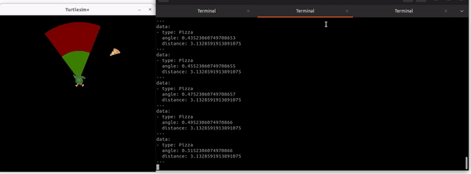

# turtlesim_plus
<p align="center">
  
</p>

"turtlesim_plus" is a tool similar to "turtlesim" with some added features such as /spawn_pizza and /eat services..   
## Installation
1.) Clone the repo to the src directory of your workspace. You must unzip and put each folder in the src directory.
2.) Add "dependencies_install.bash" to your workspace [outside of the src directory]. Execute the script to install all necessary Python libraries and ROS2 Packages.
```
source [your_workspace]/dependencies_install.bash
```

3.) Build "turtlesim_plus" and "turtlesim_plus_interfaces" in your workspace.
```
cd ~/[your_workspace]
colcon build --packages-select turtlesim_plus turtlesim_plus_interfaces
source install/setup.bash
```
## Using turtlesim_plus

1.) Run turtlesim_plus_node
```
ros2 run turtlesim_plus turtlesim_plus_node
```

2.) Move the turtle

```
ros2 run turtlesim turtle_teleop_key
```

3.) Spawn a pizza (or more !!) by using "pizza_on_click.py" and click on the GUI.

```
ros2 run turtlesim_plus pizza_on_click.py
```

4.) Echo the scan data
```
ros2 topic echo /turtle1/scan
```
5.) Move the robot so that the greeen region overlap with the spawn pizza and check the scan
6.) Call /eat service to eat the pizza
```
ros2 service call /turtle1/eat std_srvs/srv/Empty
```
7.) You can see the pizza count of 'turtle1'
```
ros2 topic echo /turtle1/pizza_count
```

